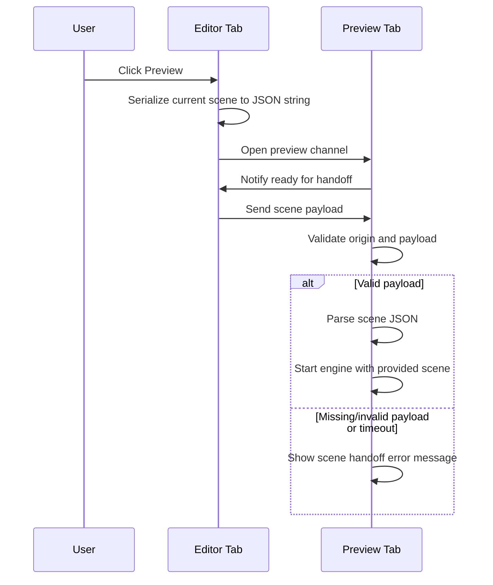

# Preview Scene Handoff Design

Date: 2026-04-18
Status: Draft
Related ADR: [0004-preview-scene-handoff](../decisions/0004-preview-scene-handoff.md)
Related issue: [#365](https://github.com/RuggeroVisintin/SparkEngineWebEditor/issues/365)

## Goal

Start preview from the current editor scene when preview opens in a separate tab.

## Non-goals

1) Real-time bi-directional scene sync between editor and preview

2) Multiplayer or collaborative editing synchronization

3) Persisting preview snapshots as user-facing assets

4) Supporting opener-less recovery in this iteration

## Constraints

1) Editor and preview run in different tabs/windows

2) Direct object references cannot be shared across tabs

3) Scene payload can be large and costly to transfer

## Decision Summary

1) Handoff uses `postMessage` between preview and opener

2) Scene is sent as serialized JSON string in message payload

3) Preview shows an explicit handoff error state when handoff fails

## High-level flow

1) User clicks Preview in editor

2) Editor captures current scene JSON snapshot

3) Editor opens preview tab/window

4) Preview sends a ready message to opener

5) Editor replies with serialized scene JSON string in payload

6) Preview parses payload and starts engine with that scene

7) If handshake fails or payload is invalid, preview shows an error message

## Handshake sequence diagram

## Message payload model

Payload shape:

1) `sceneJsonString: string`

Validation:

1) Ensure payload exists and is a string

2) Ensure payload can be parsed to valid scene JSON

## System responsibilities

1) Editor runtime responsibilities
- Capture the current scene snapshot when preview is requested.
- Open preview in a separate tab/window.
- Reply to preview readiness by sending a scene payload.

2) Preview runtime responsibilities
- Announce readiness to receive scene payload.
- Validate and parse incoming payload.
- Start preview from the received scene.
- Show an explicit error state when handoff fails.

3) Handoff protocol responsibilities
- Use a single payload contract with serialized scene JSON.
- Ensure messages are accepted only from trusted origin/source.
- Keep behavior deterministic: successful handoff starts preview, failed handoff shows error.

4) Assets serialization/deserialization - See [ADR](./decisions/0005-preview-scene-assets-sharing.md)

## Failure modes and behavior

1) If scene handoff is unavailable, delayed, or invalid for any reason, preview shows an explicit error message and does not start with a fallback scene.

Detailed failure-mode handling is intentionally deferred to later iterations and will be informed by production usage.

## Security considerations

1) Validate origin for every incoming message

2) Do not execute arbitrary code from transfer payload

3) Keep payload as scene JSON; callback deserialization remains existing controlled logic

